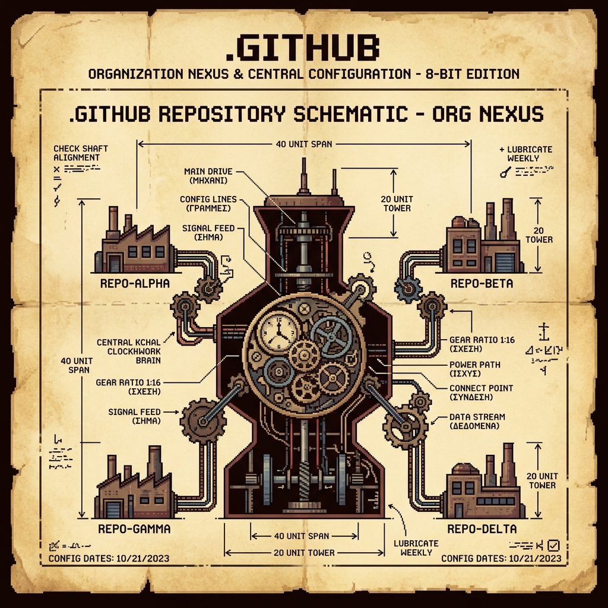

# .github

<p align="center">
  
</p>

This repository acts as the **Central Nexus & Configuration Registry** for the `borch-ai` organization. It hosts shared workflows, issue and pull request templates, contribution guidelines, and global organizational settings.

---

## ⚙️ Repository Structure

```text
├── assets/
│   └── logo.png              # Org Nexus logo
├── CONTRIBUTING.md           # Organization-wide contribution guidelines
├── CODEOWNERS                # Shared repository ownership assignments
└── .github/
    ├── workflows/            # Reusable GitHub Actions Workflows
    │   ├── ci-self-test.yml         # Self-test validation of workflows
    │   ├── go-ci-with-sibling.yml   # Go project testing with a sibling package
    │   ├── go-ci-standalone.yml     # Standalone Go project testing
    │   ├── pr-title.yml             # Conventional Commit title verification
    │   ├── pr-description.yml       # PR template validation check
    │   ├── markdown-lint.yml        # Markdown linting
    │   ├── release.yml              # Automated tagging & releases
    │   └── scorecard.yml            # OpenSSF Security Scorecard scans
    └── ISSUE_TEMPLATE/       # Shared bug report & feature templates
```

---

## 🔒 Security & Reusable Workflows

To ensure maximum security and protect against supply chain attacks, downstream factories (`pithos`, `aeolian`, `lighthouse`, `daedalus`, `lamplighter`) consume these workflows using **strict commit SHA pinning**:

```yaml
jobs:
  run:
    uses: borch-ai/.github/.github/workflows/go-ci-with-sibling.yml@89b5ce47890d1cf60a71826f915ad5769f47e8f4 # v1.0.0
```

* **Automated Tagging:** When updates are merged into the `main` branch of this repository, an automated post-merge `release.yml` job triggers, calculates the next semantic version tag from conventional commits, and creates a Git release.
* **Auto-Advancing Pins:** Downstream repositories use Dependabot (configured with `github-actions` ecosystems) to automatically detect these new tags, resolve them to the new commit SHA, and open PRs to advance the pins.
