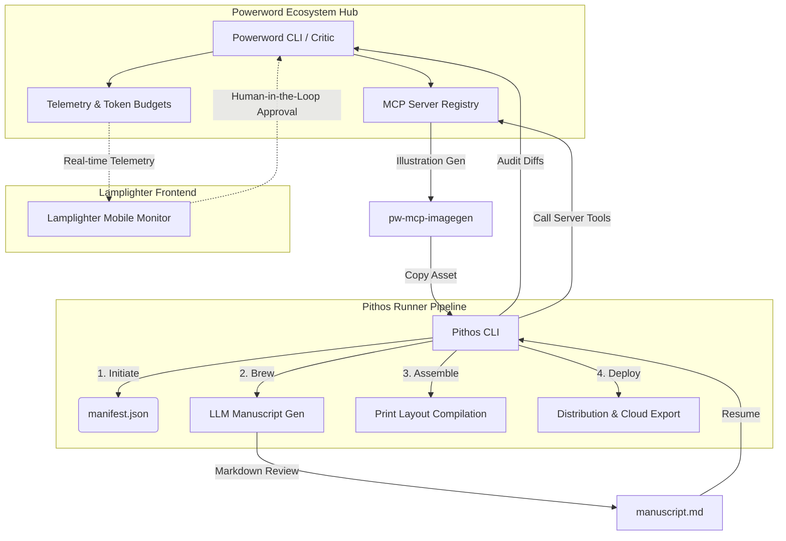

<p align="center">
  
</p>

#  borch-ai

> Generative Book Orchestration Ecosystem for AI Agents

Welcome to **borch-ai**, a deterministic generative publishing ecosystem designed to orchestrate complex book writing, illustration, and validation pipelines with absolute reliability.

---

## 🛠️ Our Ecosystem

We build tooling that bridges deterministic pipelines, agentic workflows, and human-in-the-loop validation.

### ⚓ [Pithos](https://github.com/borch-ai/pithos)
A rigid, deterministic book orchestration pipeline that takes concepts from initiation to final distribution.
- **Structured Pipeline**: Procedural execution through strictly sequenced states (`initiate` ➔ `brew` ➔ `assemble` ➔ `deploy`).
- **Local Review Loops**: Seamless Markdown review/edit syncing (`manuscript.md`) to pause execution and allow off-line content refinement before illustration.
- **MCP Native**: Plugs directly into Model Context Protocol (MCP) servers like `pw-mcp-imagegen` for automated, parallel asset generation.

### ⚡ [Powerword](https://github.com/borch-ai/powerword)
The core MCP plugin repository and developer toolkit for local validation and auditing.
- **Developer Critic**: Advanced workspace analyzers that validate branch changes against structured plans (`powerword review --local`).
- **Telemetry & Cost Accounting**: Fine-grained token usage tracking, budget management, and model cost analysis.
- **MCP Servers**: High-performance MCP servers for image generation, Amazon SEO optimization, and Google Docs integrations.

### 🏮 [Lamplighter](https://github.com/borch-ai/lamplighter)
Our companion mobile frontend for remote pipeline monitoring and human-in-the-loop approvals.
- **Real-time Monitoring**: Track compilation logs, token costs, and illustration outputs directly from your phone.
- **Human-in-the-Loop**: Approve or request rewrites of stanzas/images on-the-fly to ensure publishing quality.

---

## 📐 Core Architecture



---

## 🚀 Getting Started

To initialize a new book workspace and run the pipeline locally:

```bash
# 1. Install Pithos and Powerword tools
go install github.com/borch-ai/pithos/cmd/pithos@latest

# 2. Initiate a new project
pithos initiate --theme "A journey through agentic coding" --pages 12 --output ./my-book

# 3. Run the manuscript generation and enter the review loop
pithos brew --review --output ./my-book
```

---

<p align="center">
  <sub>Built with ❤️ by the borch-ai team. Code quality audited by <b>Powerword Critic</b>.</sub>
</p>
